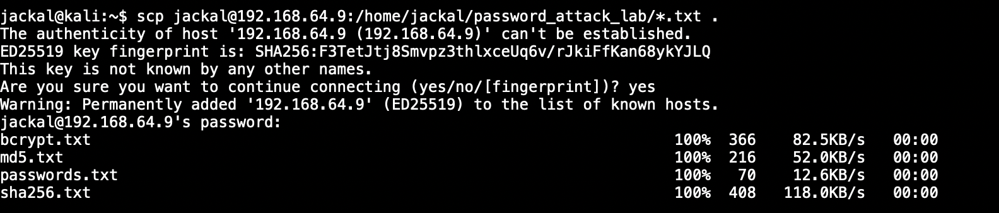
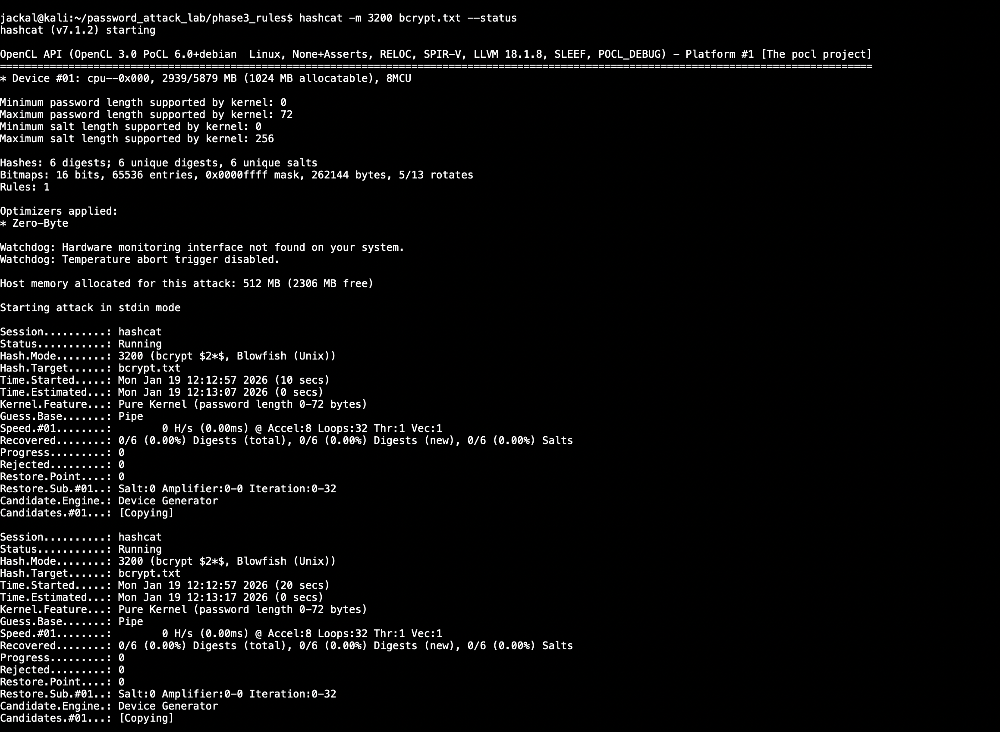
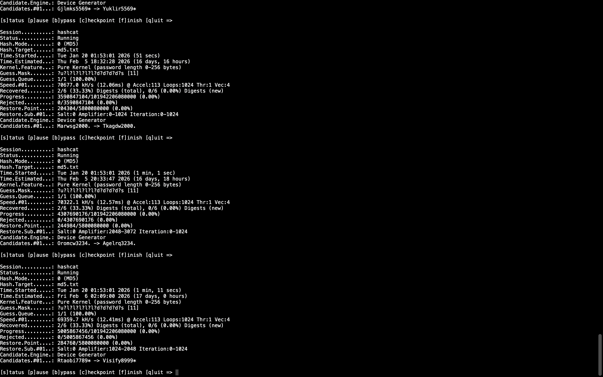
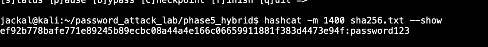
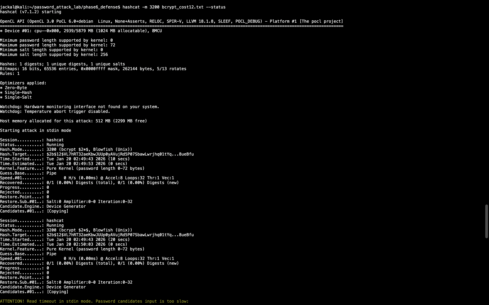

# 🔐 Password Attack & Defensive Hardening Lab

An end-to-end cybersecurity lab simulating post-breach offline password attacks and demonstrating how defensive choices impact attacker feasibility.

---

##  Objectives
- Simulate real-world password cracking techniques
- Compare MD5, SHA-256, and bcrypt under attack
- Demonstrate why modern password hashing matters
- Analyze attacker economics vs defensive controls

---

##  Lab Environment
- Kali Linux (attacker)
- Ubuntu Linux (hash generation)
- Tools: Hashcat, rockyou wordlist, custom rules & masks

---

##  Project Phases

### Phase 1 – Hash Generation
Generated password hashes using:
- MD5
- SHA-256
- bcrypt

📷 Example:

---

### Phase 2 – Hash Transfer Simulation
Simulated post-breach hash exfiltration between systems.

📷 Example:

---

### Phase 3 – Rule-Based Attacks
Used Hashcat rule sets to amplify dictionary attacks.

📷 Example:

---

### Phase 4 – Mask Attacks
Demonstrated pattern-based attacks exploiting predictable password structures.

📷 Example:

---

### Phase 5 – Hybrid Attacks
Combined dictionary + mask attacks:
- MD5 cracked quickly
- SHA-256 cracked with predictable patterns
- bcrypt resisted effectively

📷 Example:

---

### Phase 6 – Defensive Hardening
- Generated bcrypt hashes with increased cost factors
- Demonstrated exponential slowdown in attack feasibility
- Showed how defenders control attacker economics

📷 Example:

---

##  Defensive Takeaways
- MD5 is cryptographically broken for password storage
- SHA-256 alone is insufficient against offline attacks
- bcrypt significantly reduces attack feasibility
- Increasing bcrypt cost makes attacks economically impractical

> Security is not about stopping all attacks, but about making attacks too expensive to succeed.

---

##  Skills Demonstrated
- Password cracking methodologies
- Hash analysis
- Attack vs defense trade-offs
- Linux tooling & workflow
- Security documentation

---

##  Disclaimer
All testing was conducted in a controlled lab environment for educational purposes only.

